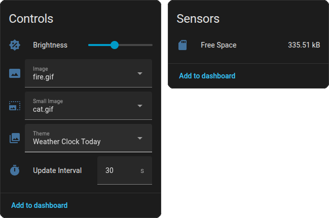
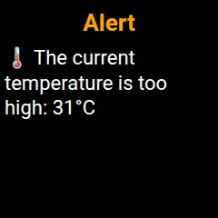

# Geek Magic Home Assistant Integration

[](https://github.com/hacs/integration)

This custom component enables integration with the **Geek Magic** smart display device in Home Assistant.

## Features

- **Controls**: 
  - Change Themes.
  - Adjust Brightness.
  - Select Images.
- **Sensors**: Monitor free space on the device.



- **HTML Rendering & Upload**: Send text or raw HTML to the device, which is rendered to an image and uploaded automatically.

 

## Installation

### HACS (Recommended)

[](https://my.home-assistant.io/redirect/hacs_repository/?owner=aydarik&repository=hass-geekmagic&category=integration)

or manually:

1.  Open **HACS** in Home Assistant.
2.  Go to **Integrations**.
3.  Click the three dots in the top right corner and select **Custom repositories**.
4.  Add the URL of this repository.
5.  Select **Integration** as the category.
6.  Click **Add**.
7.  Find **Geek Magic** in the integration list and install it.
8.  Restart Home Assistant.

### Manual Installation

1.  Copy the `custom_components/geek_magic` directory to your Home Assistant `config/custom_components/` directory.
2.  Restart Home Assistant.
3.  Go to **Settings > Devices & Services > Add Integration**.
4.  Search for **Geek Magic** and select it.
5.  Enter the **IP Address** of your Geek Magic device.

## Configuration

### Basic Setup
During the initial setup, you need to provide the device's IP address. You can also optionally configure the **Render URL** and **HTML Template** at this stage.

### Advanced Options (HTML Rendering)
If you skipped configuring the Render URL during setup, you can do it later:
1.  Go to **Settings > Devices & Services**.
2.  Click **Geek Magic**.
3.  Click **Configure**.
4.  **Render URL**: Enter the URL of your rendering service (e.g., `http://192.168.1.50:8000/render`).
5.  **HTML Template**: (Optional) Customize the default HTML template used when sending simple subject/text messages.

## Services

### `geek_magic.send_html`

Sends a message or custom HTML to the device. The content is rendered to a 240x240px JPEG and uploaded.

**Parameters:**

| Name | Type | Description | Required |
| :--- | :--- | :--- | :--- |
| `entity_id` | string | The entity ID of the Geek Magic device (e.g. `sensor.geek_magic_image`) | Yes |
| `subject` | string | Title/Subject text to display (inserted into template) | No* |
| `text` | string | Body text to display (inserted into template) | No* |
| `html` | string | Raw HTML to render. Overrides `subject` and `text`. | No* |

*\*Either `html` OR (`subject` and `text`) must be provided.*

**Example: Sending a simple notification**
```yaml
action: geek_magic.send_html
data:
  entity_id: select.geek_magic_image
  subject: "Alert"
  text: "Washing Machine finished!"
```


**Example: Sending a complex notification**
```yaml
action: geek_magic.send_html
data:
  entity_id: select.geek_magic_image
  subject: Main door
  text: |
    

```


**Example: Sending completely custom HTML**
```yaml
action: geek_magic.send_html
data:
  entity_id: select.geek_magic_image
  html: |
    <html lang="en">
    <head>
        <title>Neon Clock</title>
        <style>
            body {
                display: flex;
                justify-content: center;
                align-items: center;
                height: 100vh;
                background: #121212;
            }
            .clock {
                width: 240px;
                height: 240px;
                border-radius: 50%;
                background: #1e1e1e;
                display: flex;
                justify-content: center;
                align-items: center;
                font-family: Arial, sans-serif;
                font-size: 48px;
                font-weight: bold;
                color: #00ffae;
                box-shadow: 0 0 15px rgba(0, 255, 174, 0.5);
            }
        </style>
    </head>
    <body>
    <div class="clock" id="clock"></div>
    <script>
        const now = new Date();
        const hours = String(now.getHours()).padStart(2, '0');
        const minutes = String(now.getMinutes()).padStart(2, '0');
        document.getElementById('clock').textContent = `${hours}:${minutes}`;
    </script>
    </body>
    </html>
```


## Render API Requirement

This integration requires an external service to convert HTML to an image if you use the `send_html` feature.

### Predefined Renderer

The integration comes with a **predefined renderer** (`https://text2image.gumerbaev.ru/render`) that works out of the box. However, for privacy reasons, we **strongly recommend** spinning up your own instance, as the HTML content (which may include sensitive data from your smart home) will be sent to an external server.

### Self-Hosted Renderer (Recommended)

You can use the [Text2Image](https://github.com/aydarik/text2image) service.

#### Home Assistant Add-on

[](https://my.home-assistant.io/redirect/supervisor_add_addon_repository/?repository_url=https%3A%2F%2Fgithub.com%2Faydarik%2Fhass-addons)

##### Manual installation

1.  Add the repository URL to your Home Assistant Add-on Store repositories:
    `https://github.com/aydarik/hass-addons`
2.  Install the "Text2Image" add-on.
3.  Start the add-on.

#### Docker

```bash
docker run -d -p 8000:8000 ghcr.io/aydarik/text2image:latest
```

> Then configure the **Render URL** in the integration settings to point to your local instance (e.g., `http://0.0.0.0:8000/render`).

### API Specification

The service should:
- Accept a POST request.
- Body: `{"html": "<your html>"}`.
- Return: `image/jpeg` binary data.
